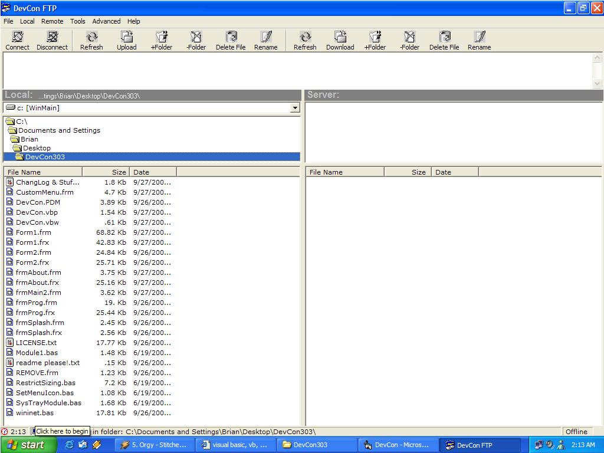



## DevCon FTP 3\.0\.3

### Description

This is an update to the old DevCon 3.0 client.DevCon FTP has local & remote file deletion, local & remote file and folder renaming, local & remote creation

or deletion of files and/or folders, upload, download, passive connections(for firewalls/proxies),

profile saving, FTP, HTTP, or Gopher connections, DNS lookup, ASCII or Binary modes, file searching, displaying file properties, file patterns, telnet shell for Unix/Linux/BSD servers, time, sizable directory structure view, clean interface, and some other neat features. This client covers most of the FTP game. However, it is missing CHMOD for Unix. I shelled out telnet because of this. The only way to change remote file permissions on a Unix server is to telnet into it from this app or Windows. At this time I am working on CHMOD for it but it is taking some time. If you are connecting to a Windows based server there shouldn't be a problem with permissions unless you have a perl, cgi, or php script that HAS to be changed. This client still needs alot of work to get it where I want it. I want to continue development on it but I am not sure if it is worth it. Let me know and please vote! I hope this helps with any questions you may have on FTP and VB.
 
### More Info
 

             |
---                |---
**Submitted On**   |2002-09-27 02:09:26
**By**             |[Brian Clark](https://github.com/Planet-Source-Code/PSCIndex/blob/master/ByAuthor/brian-clark.md)
**Level**          |Intermediate
**User Rating**    |4.9 (74 globes from 15 users)
**Compatibility**  |VB 6\.0
**Category**       |[Internet/ HTML](https://github.com/Planet-Source-Code/PSCIndex/blob/master/ByCategory/internet-html__1-34.md)
**World**          |[Visual Basic](https://github.com/Planet-Source-Code/PSCIndex/blob/master/ByWorld/visual-basic.md)
**Archive File**   |[DevCon\_3\_01369609272002\.zip](https://github.com/Planet-Source-Code/brian-clark-devcon-ftp-3-0-3__1-39307/archive/master.zip)

